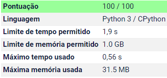
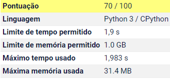

# **Introdução**
Implementação do Exercício [Lista Palíndroma](https://olimpiada.ic.unicamp.br/pratique/ps/2021/f2/lista/) presente na Segunda Fase da Nível Sênior da OBI de 2021.

#**Apresentação do Problema**
Uma palavra é chamada de palíndromo se a primeira letra da palavra é igual à última letra da palavra, a segunda letra é igual à penúltima letra, a terceira letra é igual à antepenúltima letra, e assim por diante. Por exemplo, as palavras osso e sopapos são palíndromos.

Nesta tarefa estamos interessados não em palavras, mas em listas de números inteiros. Nesse caso, vamos definir que uma lista é palíndroma se L[i] = L[N-i+1], onde L[i] representa o i-ésimo elemento da lista (note que nesta notação o índices variam de 1 a N).

Você pode modificar uma lista usando a operação de contração, que é definida da seguinte forma: escolha dois elementos adjacentes da lista e substitua os dois elementos por um único elemento de valor igual à soma dos elementos substituídos. Note que ao efetuar uma operação de contração o número de elementos da lista decresce de um elemento.

Dada uma lista de números inteiros, você deve escrever um programa para determinar o menor número de operações de contração que devem ser realizadas de modo que a lista resultante seja palíndroma.

**Entrada**
A primeira linha da entrada contém um inteiro N, o número de elementos da lista. A segunda linha contém N inteiros Li, os elementos da lista.

**Saída**
Seu programa deve produzir uma única linha, contendo um único inteiro, o menor número de operações de contração necessárias para tornar a lista palíndroma.

#**Algoritmo Empregado**
O exercício acima representa uma variação do problema clássico de verificação de palíndromos, apenas com  a adição da operação de *contração* especificada acima. Dessa forma, o algoritmo para a solução será relativamente parecida com a solução para um problema clássico de palíndromo.

Primeiramente, inicia-se o algoritmo com duas posições: **início** e **final**, que representam o primeiro e o último elemento da lista de valores a serem avaliados, respectivamente.
Em seguida, compara-se o início com o final, no caso de *elemento[início] = elemento[final]*, basta deslocar o início para a próxima posição e deslocar o final para a posição anterior.

Caso *elemento[início] < elemento[final]*, basta acessar o elemento imediatamente a frente do início e somar a ele o valor do início, deslocar a referência do início para essa posição e incrementar em um o número de contrações.

Já no caso *elemento[início] > elemento[final]*, basta acessar o elemento anterior ao final e adicionar a ele o valor do final, deslocar a referência do final para essa posição e incrementar em um o número de contrações.

Por fim, repete-se esse processo enquanto *início < final*.
Dessa forma, o número mínimo de contrações será obtido ao final da execução do algoritmo.

Em questão de eficiência, o algoritmo acima apresenta compplexidade temporal *O(n)*, já que é necessário acessar todas as posições da lista uma vez.

#**Especificação da Implementação**
Na implementação realizada, criou-se um classe simples, que ao ser iniciada recebe o tamanho da lista e todos os seus elementos, separados por whitespaces.
No caso da lista de elementos ser maior que o tamanho especificado, a a classe utilizará somente os n primeiros elementos, sendo *n = tamanho*.

Já no caso do tamanho especificado ser superior ao número de elementos fornecidos, a classe ajustará o valor de maneira a refletir efetivamente o tamanho da lista.

Por fim, a classe invoca um método que retorna número mínimo de contrações a serem realizadas, utilizando o algoritmo especificado na seção anterior.

#**Remoção de Elementos**
Um algoritmo muito similiar ao explicitado acima pode ser obtido também removendo elementos da lista ao realizar uma operação de contração nos casos *elemento[início] > elemento[final]* e *elemento[início] < elemento[final]*.
Dessa forma, teria-se ao final do programa a lista atualizada, a qual seria o maior palíndromo possível.

No entanto, essa abordagem apresenta o problema de ser muito custosa no sentido de tempo de execução.
Isso ocorre em função da remoção de elementos de uma lista ser uma operação que é relativamente demorada e considerando que ela terá que ser realizada até n-1 vezes, para uma lista de tamanho n, o efeitos desta implementação tornam-se bem expressivos rapidamente.

Nas imagens acima, é possível observar a diferença de eficiência temporal ao ser submetido pelos testes aplicados pela correção do site da OBI.
O algoritmo sem remoção de elementos é cerca de **3.5 vezes** mais rápido que a implementação que utiliza remoção de elementos.
Em função disso e das lmitações de tempo impostas pela questão, o algortimo sem remoção foi o escolhido em oposição ao algoritmo com remoção.   
  
